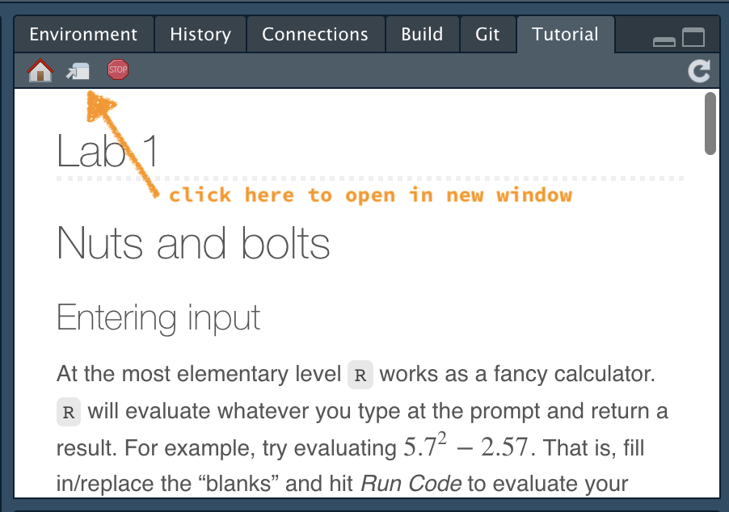
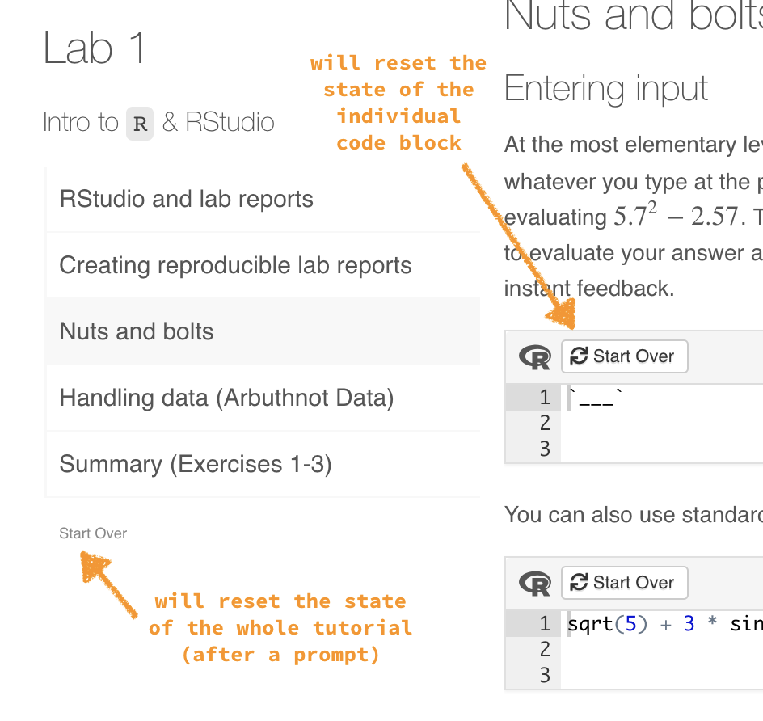

# README

Welcome. The lab tutorials, templates, functions, and data files required for MA22004 - Statistics and Probability II at the University of Dundee are available at this repository as an `R` package. 

Instructions for installing `R` and RStudio can be found here:
[https://learnr-examples.shinyapps.io/ex-setup-r/](https://learnr-examples.shinyapps.io/ex-setup-r/).

**Please ensure that you have a current version of `R` (>= 4.0.2 "Taking Off Again" released on 2020/06/22).** 
`R` can be downloaded from *CRAN* at [https://cran.r-project.org/](https://cran.r-project.org/). 
Follow the appropriate link for your operating system. 

Older versions of `R` may work (probably not), but I have not been able to test them. 

## Installation

Follow these three steps to install the package `MA22004labs` using RStudio: 

1.  Install the `devtools` package.
2.  Source the `MA22004labs` package from GitHub.
3.  Give permission to RStudio to install any required dependencies. 

The first two steps are initiated by running the following code in the console. 

```
install.packages("devtools")
devtools::install_github("dundeemath/MA22004labs")
```

The `MA22004labs` package includes a list of dependencies (packages that are used in one or more of the lab tutorials). RStudio will try to install these dependencies but will need to ask for your permission. Please give permission to update/install packages as required. RStudio will prompt you for permission in the console (usually, you will be asked to enter "1" or "Yes" to proceed with the updates/installs).


## Run Tutorials

The tutorials are labeled `lab0n` for `n = 1, 2, ..., 7`, e.g., the first lab tutorial is `lab01`. There are a few ways to run tutorials. 

-  You can run the tutorials directly from the console using the command:

```
learnr::run_tutorial("lab01", "MA22004labs")
```

-  In newer versions of RStudio, the tutorials can also also be run from the *Tutorial* tab in the upper right-hand pane (a neighbor of *Environment*, *History*, etc). Navigate through the list to the appropriate tutorial and select "Start Tutorial >". The tutorial window can be enlarged by selecting the option between the little house and the stop sign in the upper left hand corner of the tutorial pane. 



-  If all else fails, try downloading the associated `.Rmd` file (found in `inst/tutorials/lab0n`) and opening it in RStudio. Then you can "Run" the file. But maybe it is a good idea to contact me first.

## Tutorial State

As you progress through the tutorial, the state (i.e. the answers you have entered) will be preserved even if you close the tutorial window. There is a small option underneath the table of contents that says "Start Over". Pressing this will reset the state of the lab (after a confirmation prompt). 



Pressing "Start Over" above an individual code chunk will reset the state of that individual code chunk. 
