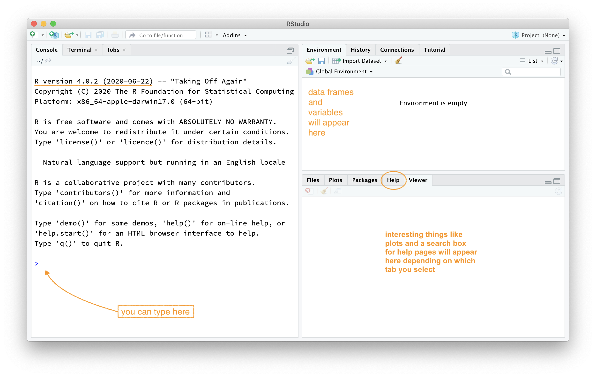

```{css, echo=FALSE}
body {
    counter-reset: li; /* initialize counter named li */
}

ol {
    margin-left:0; /* Remove the default left margin */
    padding-left:0; /* Remove the default left padding */
}
ol > li {
    position:relative; /* Create a positioning context */
    margin:0 0 10px 2em; /* Give each list item a left margin to make room for the numbers */
    padding:10px 80px; /* Add some spacing around the content */
    list-style:none; /* Disable the normal item numbering */
    border-top:2px solid #317EAC;
    background:rgba(49, 126, 172, 0.1);
}
ol > li:before {
    content:"Exercise " counter(li); /* Use the counter as content */
    counter-increment:li; /* Increment the counter by 1 */
    /* Position and style the number */
    position:absolute;
    top:-2px;
    left:-2em;
    -moz-box-sizing:border-box;
    -webkit-box-sizing:border-box;
    box-sizing:border-box;
    width:7em;
    /* Some space between the number and the content in browsers that support
       generated content but not positioning it (Camino 2 is one example) */
    margin-right:8px;
    padding:4px;
    border-top:2px solid #317EAC;
    color:#fff;
    background:#317EAC;
    font-weight:bold;
    font-family:"Helvetica Neue", Arial, sans-serif;
    text-align:center;
}
li ol,
li ul {margin-top:6px;}
ol ol li:last-child {margin-bottom:0;}

.oyo ul {
    list-style-type:decimal;
}

.oyo ul {
    list-style-type:decimal;
}


hr {
    border: 1px solid #357FAA;
}

div#boxedtext {
    background-color: rgba(86, 155, 189, 0.2);
    padding: 20px;
    margin-bottom: 20px;
    font-size: 10pt;
}

div#template {
    margin-top: 30px;
    margin-bottom: 30px;
    color: #808080;
    border:1px solid #808080;
    padding: 10px 10px;
    background-color: rgba(128, 128, 128, 0.2);
    border-radius: 5px;
}

div#license { 
    margin-top: 30px;
    margin-bottom: 30px;
    color: #4C721D;
    border:1px solid #4C721D;
    padding: 10px 10px;
    background-color: rgba(76, 114, 29, 0.2);
    border-radius: 5px;
}

/*------------ Fancy blocks --------------*/

.noteblock {
  padding: 1em 1em 1em 6em;
  margin-bottom: 20px;
  margin-top: 20px;
  border-left: 6px solid #042e6b;
  background: 1.5em center/2.5em no-repeat;
  background-image: url("images/info-circle.svg");
}

.tipblock {
  padding: 1em 1em 1em 6em;
  margin-bottom: 20px;
  margin-top: 20px;
  border-left: 6px solid #d5d5ce;
  background: 1.5em center/2em no-repeat;
  background-image: url("images/lightbulb.svg");
}

.warningblock {
  padding: 1em 1em 1em 6em;
  margin-bottom: 20px;
  margin-top: 20px;
  border-left: 6px solid #be4e00;
  background: 1.5em center/2.5em no-repeat;
  background-image: url("images/exclamation-triangle.svg");
}

.importantblock {
  padding: 1em 1em 1em 6em;
  margin-bottom: 20px;
  margin-top: 20px;
  border-left: 6px solid #c30000;
  background: 1.5em center/2.5em no-repeat;
  background-image: url("images/exclamation-circle.svg");
}

.exerciseblock {
  padding: 1em 1em 1em 6em;
  margin-bottom: 20px;
  margin-top: 20px;
  border-left: 6px solid #317EAC;
  background: rgba(49, 126, 172, 0.1) 1.5em center/2.5em no-repeat;
  background-image: url("images/flag.svg");
}

.indentblock {
  padding: 1em 1em 1em 6em;
  margin-bottom: 20px;
  margin-top: 20px;
  border-left: 6px solid #FFFFFF;
  #background: rgba(49, 126, 172, 0.1) 1.5em center/2.5em no-repeat;
  #background-image: url("images/flag.svg");
}
```

```{r setup, include = FALSE}
library(MA22004labs)
library(tidyverse)
library(learnr)
library(gradethis)
library(knitr)

# tutorial options
tutorial_options(
  # code running in exercise times out after 30 seconds
  # if it is taking more than 30 s something is wrong 
  exercise.timelimit = 30,
  # use gradethis for checking
  exercise.checker = gradethis::grade_learnr
  )
options(width = 60)

# hide non-exercise code chunks
knitr::opts_chunk$set(echo = FALSE, error = TRUE, comment = "", fig.align = "center", fig.width = 6, fig.asp = 0.75, out.width = "100%")
bob <- c("a", "b", "c")
data(arbuthnot)
```

## RStudio and lab reports

The goal of this lab is to introduce you to `R` and RStudio, which you'll be using throughout the course both to learn the statistical concepts and to analyze real data and draw informed conclusions. To clarify which is which: `R` is the name of the statistical programming language that you will code in and RStudio is an application that provides a convenient interface for working with `R`.

As the labs progress, you are encouraged to explore beyond what the labs dictate; a willingness to experiment will make you a much better programmer! Before we get to that stage, however, you need to build some basic fluency in `R`. First, we will explore the fundamental building blocks of `R` and RStudio: the RStudio interface, reading in data, and basic commands for working with data in `R`.

:::{.noteblock}
The report for Lab 1 consists of answers to exercises 1-4f in the last section of this tutorial. The exercises are also included in-line to provide context (note the blue flags), however, this will not always be the case for future labs. You will upload your submission to [Gradescope](https://www.gradescope.com) as a PDF. An `rmarkdown` template called *MA22004 Lab Report* is provided. Further details about how to use the template to create your report are included in Section "RStudio and lab reports" of this interactive Lab. 
:::

### RStudio interface 

If you are already running this Lab tutorial then you have successfully installed and launched RStudio. Well done! You should see a window that looks more or less like the image shown below (I've added a few comments). 

```{r r-interface-2020, fig.margin = TRUE, echo = FALSE, fig.width = 3, out.width = "100%", fig.cap="A fresh *RStudio* window. Please try to use `R` version **4.0.2 (2020-06-22) \"Taking Off Again\"** or higher."}

```

The RStudio window is divided into various panels. 

The panel on the lower left is where the action happens.
This panel is called the *console*.
Every time you launch RStudio, it will have the same text at the top of the console telling you the version of `R` that you're running.
Below that information is the *prompt*, indicated by the `>` symbol.
As its name suggests, this prompt is really a request: a request for a command.
Initially, interacting with `R` is all about typing commands and interpreting the output.
These commands and their syntax have evolved over decades (literally) and now provide what many users feel is a fairly natural way to access data and organize, describe, and invoke statistical computations.

The panel in the upper right contains your *environment* as well as a history of the commands that you've previously entered.

The panel in the lower right contains tabs to browse the *files* in your project folder, access *help* files for `R` functions, install and manage `R` *packages*, and inspecting visualizations or *plots*. 


### `R` Packages

`R` is an open-source programming language, meaning that users can contribute packages that make our lives easier, and we can use them for free.
For this lab, and many others in the future, we will use the following:

-   The **MA22004labs** `R` package: for tutorials, templates, data sets and custom functions 
-   The **tidyverse** "umbrella" package which houses a suite of many different `R` packages for data wrangling and data visualization
-   The **learnr** `R` package: for running these interactive lab tutorials
-   The **gradethis** `R` package: to serve you answers to interactive tutorial exercises

In the lower right-hand panel of RStudio, select the *Packages* tab. Type the name of each package (e.g., `tidyverse`) into the search box that appears to see if a package has been installed. If the package does not appear when you type in the name, it can be installed using the `install.packages` command. 

```{r install-packages, message = FALSE, eval = FALSE, echo = TRUE}
# If you installed the package "MA22004labs" then `tidyverse` 
# will have already been installed as a dependency. 
install.packages("tidyverse") 
```

After pressing enter/return, a stream of text will begin, communicating the process `R` is going through to install the package.
If you were not prompted to select a server for downloading packages when you installed `R`, RStudio may prompt you to select a server from which to download; any of them will work.

### Loading packages

You only need to *install* packages once, but you need to *load* them each time you relaunch RStudio.
We load packages with the `library` function. For example, to load the `tidyverse` package into your working environment you would use the following code. 

```{r load-packages, echo = TRUE, eval = FALSE}
library(tidyverse)
```

The tidyverse package consists of a set of packages necessary for different aspects of working with data---anything from loading data to wrangling data to visualizing data to analyzing data.
Additionally, these packages share common philosophies and are designed to work together. You can find more about the packages in the tidyverse at [tidyverse.org](http://tidyverse.org/).

## Creating reproducible lab reports

As part of your grade for MA22004 you will need to submit lab reports. I have provided a template file that can be accessed through RStudio after you install and load the `MA22004labs` package (recall that the package can be loaded by typing `library(MA22004labs)` at the RStudio console prompt). 

Access the template by selecting **New File > R Markdown**. You will then be greeted with a pop-up window. Choose **From Template** from the left-hand pane and then select **MA22004 Lab Template**. A new **Untitled.Rmd** file will open. Feel free to change the name to something sensible and save it where you like. The final PDF is created using the **Knit** shortcut from the menu bar (**File > Knit Document** if you cannot find the shortcut). Submit the lab report as a PDF but please also retain the lab report markdown file. 

### Why use R Markdown for Lab Reports?

Please watch this short video that summarizes the .

[**Why use R Markdown for Lab Reports?**](https://youtu.be/lNWVQ2oxNho) <iframe width="560" height="315" src="https://www.youtube.com/embed/lNWVQ2oxNho" frameborder="0" allowfullscreen></iframe>

In a nutshell, using the template will allow you to easily combine data analysis ("`R` chunks") with text in a portable and reproducible format. You can also easily include mathematical typesetting in your text content using $\LaTeX$ syntax.

### Template in detail 

Let's take a look at the anatomy of the template. The template is an R Markdown document and the file name should end in `.Rmd`. 

At the top, there is a section that looks like this:

```markdown
---
title: "Lab NUMBER: TITLE"
author: "TEST STUDENT --- ID-NUMBER"
date: "'r Sys.Date()'"
output:
  pdf_document: default
papersize: a4
---
```

You should **update** the lab title and author information (retaining the quotes) with your title, name, and student ID number. The date will automatically update when you Knit the document, but of course you can change that if you want too.  

The next part of the template contains an `R` chunk with some options that are loaded but will not be printed in the final report due to the option `include = FALSE`. 

````markdown
`r ''` ```{r setup, include = FALSE}
### Some formatting options
options(width = 80)
knitr::opts_chunk$set(fig.width = 6, fig.asp = 0.75, fig.align = "center")

### LOAD NECESSARY PACKAGES HERE
library(MA22004labs)
```
````

The Knit command will interpret the gray box as `R` code because it begins with three tick marks (\`\`\`), followed by {`r` `setup`}. The **name** of this code chunk is `setup`; each code chunk in an R Markdown document *must* have a unique name. The command `library(openintro)` loads a package that contains data needed for your first lab assignment. You may add other commands to the setup chunk if you want --- but remember you won't see them in the final report. 

The rest of the template contains prompts for text and `R` code. **Update these with your text as appropriate.** To produce the final document you must "knit" the document into a Word Document or directly into a LaTeX PDF. You do this by selecting the the appropriate option from the "Knit" menu in RStudio. 

```{r r-knit-menu, fig.margin = TRUE, echo = FALSE, fig.width = 3, out.width = "75%", fig.cap="The Knit menu allows you to effortlessly produce a reproducible lab report combining both data analysis and text. If there is ever a question about you analysis, you can follow up by sending the source code!"}

```
 
To produce your lab report, you should create an R Markdown document containing text and code associated with each problem. Place your code in `R` code chunks and ensure each chunk has a unique label. If you want to test your code as you go, then there are two ways to execute a line of `R` code within your R Markdown document: (1) place your cursor on the line on code and press `Ctrl-Enter` or `Cmd-Enter` (depending on your operating system), or (2) place your cursor on the line and press the "Run" button in the upper right hand corner of the R Markdown file.

### What happens when you *knit* an R Markdown File?

When you click the **Knit** button a document will be generated that includes both text content as well as the output of any embedded R code chunks within the document. 

For example, you can write an R code chunk like this in your R Markdown document:

````markdown
`r ''` ```{r cars, echo = TRUE, eval = TRUE}
summary(cars)
```
````

which will render as:

```{r cars, echo = TRUE, eval = TRUE}
summary(cars)
```

As another example, you can include a code chunk like this (note here we used the `echo = FALSE` option):

````markdown
`r ''` ```{r pressure, echo = FALSE, eval = TRUE}
ggplot(data = pressure, aes(x = temperature, y = pressure)) + 
  geom_point()
```
````

which will render as:

```{r pressure, echo = TRUE, eval = TRUE}
ggplot(data = pressure, aes(x = temperature, y = pressure)) + 
  geom_point()
```

Text content can contain typeset mathematics expressions using standard $\LaTeX$ syntax.  

For example,
`$\alpha$` produces $\alpha$, `$\beta$` produces $\beta$, `$\gamma$` produces $\gamma$, etc. The equation for a line can be included as `$y = m x + b$` to produce $y=mx+b$. If you want the same to appear as a "displayed" equation (i.e., on its own line) then you type `\[ y=mx+b \]` or `$$y=mx+b$$` to produce: \[y=mx+b\]

Please see the *$\LaTeX$ Math for Undergrads* handout posted to the MyDundee coursepage for commonly used mathematics symbols. Or, if you have a specific symbol in mind but don't know what it is called, then try [Detexify](https://detexify.kirelabs.org/classify.html).  

## Nuts and bolts

### Entering input

At the most elementary level `R` works as a fancy calculator. `R` will evaluate whatever you type at the prompt
and return a result.  For example, try evaluating $5.7^{2}-2.57$. That is, fill in/replace the "blanks" and hit *Run Code* to evaluate your answer and/or *Submit Answer* (if the option is available) for instant feedback.

```{r ex-input-basic, exercise = TRUE}
`___`
```

```{r ex-input-basic-check}
grade_result(
  pass_if(~ identical(.result[1], 29.92)),
  fail_if(~ TRUE)
)
```

You can also use standard mathematical functions and operations.  

```{r ex-input-basicplus, exercise = TRUE}
sqrt(5) + 3 * sin(pi/2) + 1/4
```

A useful feature of `R` is its ability to create plots.  These typically appear in RStudio on the lower right hand panel in the Plots tab. Fill in the blank below to generate a scatter plot of **100** random numbers drawn from a Uniform distribution between 0.0 and 5.0:

```{r ex-input-plot, exercise = TRUE}
plot(runif(`___`, 0.0, 5.0))
```

```{r ex-input-plot-solution}
plot(runif(100, 0.0, 5.0))
```

The standard `plot` command is quite restrictive. We will use a very modern data visualization package called `ggplot2` from the `tidyverse` in the module. 

### Working with arrays

The `R` language is based on objects which you can create, manipulate and delete.  The most basic object for holding data is called an array and is just an ordered list of things.  These are created using the function `c`. Often these things are numbers.  Fill in the blanks to create an array (suggested variable name `alvin`) containing just three numbers.

```{r ex-input-array, exercise = TRUE}
alvin <- c(`___`, `___`, `___`)
```

```{r ex-input-array-check}
grade_result(
  pass_if(~ (length(.result) == 3) & identical(class(.result), "numeric"), 
          "You entered a numeric array of length 3."),
  fail_if(~ !(length(.result) == 3), "Either too many or too few elements."),
  fail_if(~ !identical(class(.result), "numeric"), "Your array is not of type numeric.")
)
```

You can also see the object by typing its name. Try running the code below.

```{r ex-input-array-showbob, exercise = TRUE}
bob <- c("a", "b", "c")
bob
```

You can also output just one element of the array via indexing: `bob[index]`. Try retrieving the second element of `bob` by filling in the blanks. 

```{r ex-input-array-bob2, exercise = TRUE}

```

```{r ex-input-array-bob2-hint}
bob[`___`]
```

```{r ex-input-array-bob2-solution}
bob[2]
```

```{r ex-input-array-bob2-check}
grade_result(
  pass_if(~ identical(.result,"b"), 
          "Yes, the second element is \"b\".")
)
```

You can use `R` to generate sequences of numbers. See what the following commands do by running the code. Note that for long-ish output, the bracketed numbers at the left correspond to the index of the element that follows.

```{r ex-input-seq1, exercise = TRUE}
c(0:100)
```

```{r ex-input-seq2, exercise = TRUE}
seq(0, 100, by=5)
```

To remove objects from your environment use the `rm()` command.

## Handling data (Arbuthnot Data)

To illustrate the power of `R` at handling larger sets of data, lets examine some data on birth records collected by Dr. John Arbuthnot, an 18<sup>th</sup> century physician, writer, and mathematician.  

:::{.tipblock}
The **Arbuthnot Baptism Data** is a collection of baptism records for children born in London for every year from 1629 to 1710. Dr. Arbuthnot was interested in the ratio of newborn boys to newborn girls. This data can be accessed using the command `arbuthnot` after loading the MA22004labs package (`library(MA22004labs)`).
:::

### Arbuthnot Baptism Data

We can take a look at the **Arbuthnot Baptism Data** by simply running the following code.

```{r view-data, exercise = TRUE}
arbuthnot
```

:::{.warningblock}
Be careful of spelling and capitalization! `R` is case sensitive, so if you accidentally type `Arbuthnot` then `R` will tell you that object cannot be found.
:::

What you should see are three columns of numbers. Each row represents a different record that includes the year, the numbers of boys baptized, and the number of girls baptized.

If you load this dataset in the `R` console, note that there will also be row numbers in the first column that are not part of Arbuthnot's data. `R` adds them as part of its printout to help you make visual comparisons. You can think of them as the index that you see on the left side of a spreadsheet. `R` has stored Arbuthnot's data in a kind of spreadsheet or table called a **data frame**.

You can see the dimensions of this data frame as well as the names of the variables and the first few observations by inserting the name of the dataset into the `glimpse()` function, as seen below:

```{r glimpse-data, exercise = TRUE}
glimpse(arbuthnot)
```

We can see that there are 82 observations and 3 variables in this dataset.
The variable names are `year`, `boys`, and `girls`.

:::{.infoblock}
As a very first step in any data exploration, it is good practice to use the `glimpse` command to get a feel for the data. Although we previously said that it is best practice to type all of your `R` code into the code chunk of your lab, it is better practice to type the `glimpse` command into your consol.

Generally, you should type all of the code that is necessary for your solution into the code chunk.
Because the `glimpse` command provides a very rudimentary exploration, it is not necessary for your lab report and **should not** be included in your solution file.
:::

You can access the dimensions of this data frame alone using the `dim` function.

```{r dim-data, exercise = TRUE}
dim(arbuthnot)
```

This command should output `[1] 82 3`, indicating that there are 82 rows and 3 columns. You can see the names of these columns (or variables) alone using the `names` function.

```{r names-data, exercise = TRUE}
names(arbuthnot)
```

At this point, you might notice that many of the commands in `R` look a lot like functions from math class; that is, invoking `R` commands means supplying a function with some number of arguments. The `dim` and `names` commands, for example, each took a single argument, the name of a data frame. 

### Some exploration

Let's start to examine the data a little more closely.
We can access the data in a single column of a data frame by extracting the column with a `$`.
For example, the code below extracts the `boys` column from the `arbuthnot` data frame.

```{r view-boys, eval = FALSE, echo = TRUE}
arbuthnot$boys
```

This command will only show the number of boys baptized each year. `R` interprets the `$` as "go to the data frame that comes before `$`, and select the variable that comes after `$`."

```{r view-girls}
question(
  "What command would you use to extract just the counts of girls baptized?",
  answer("`arbuthnot$girls`", correct = TRUE),
  answer("`arbuthnot[girls]`", message = "Actually, `arbuthnot['girls']` would also work. But this answer is not that!"),
  answer("`arbuthnot = girls`"),
  answer("`arbuthnot.girls`"),
  allow_retry = TRUE,
  random_answer_order = TRUE
)
```

Notice that the way `R` has printed these data is different.
When we looked at the complete data frame, we saw 82 rows, one on each line of the display.
These data have been extracted from the data frame, so they are no longer structured in a table with other variables.
Instead, these data are displayed one right after another.
Objects that print out in this way are called *vectors*; similar to the vectors you have seen in mathematics courses, vectors represent a list of numbers.
`R` has added numbers displayed in [brackets] along the left side of the printout to indicate each entry's location within the vector.
For example, 5218 follows `[1]`, indicating that `5218` is the first entry in the vector.
If `[43]` was displayed at the beginning of a line, that indicate that the first number displayed on that line would correspond to the 43<sup>rd</sup> entry in that vector.

### Data visualization 

`R` has some powerful functions for making graphics. 

We can create a simple plot of the number of girls baptized per year with the following code:

```{r plot-girls-vs-year, exercise = TRUE}
ggplot(data = arbuthnot, aes(x = year, y = girls)) + 
  geom_point()
```

In this code, we use the `ggplot()` function to build a plot.
If you run this code chunk, a plot will appear below the code chunk.
The R Markdown document displays the plot below the code that was used to generate it, to give you an idea of what the plot would look like in a final report.

The command above also looks like a mathematical function.
This time, however, the function requires multiple inputs (arguments), which are separated by commas.

With `ggplot()`:

-   The first argument is always the name of the dataset you wish to use for plotting.
-   Next, you provide the variables from the dataset to be assigned to different `aes`thetic elements of the plot, such as the x and the y axes.

These commands will build a blank plot, with the variables you assigned to the x and y axes.
Next, you need to tell `ggplot()` what type of visualization you would like to add to the blank template.
You add another layer to the `ggplot()` by:

-   adding a `+` at the end of the line, to indicate that you are adding a layer
-   then specify the `geom`etric object to be used to create the plot.

Since we want to scatterplot, we use `geom_point()`.
This tells `ggplot()` that each data point should be represented by one point on the plot.
If you wanted to visualize the above plot using a line graph instead of a scatterplot, you would replace `geom_point()` with `geom_line()`.
This tells `ggplot()` to draw a line from each observation with the next observation (sequentially).


Create a line plot of female baptisms by year from the **Arbuthnot Baptism Data** by complete the code below. 

```{r plot-girls-vs-year-line, exercise = TRUE}
ggplot(data = arbuthnot, aes(x = year, y = girls)) + 
  `___`
```

```{r plot-girls-vs-year-line-solution}
ggplot(data = arbuthnot, aes(x = year, y = girls)) +
  geom_line()
```

:::{.exerciseblock}
Using the **Arbuthnot Data Set**, generate a line plot of female baptisms by year using `ggplot`. Is there an apparent trend in the number of girls baptized over the years? How would you describe it? (To ensure that your lab report is comprehensive, be sure to include the code needed to make the plot as well as your written interpretation.)

```{r answer-1a, exercise = TRUE}

```

```{r answer-1a-hint}
ggplot(data = `___`, aes(`___`)) + `___`
```

```{r answer-1b}
question_text(
  "Enter your solution as free text below.",
  answer("C0rrect", correct = TRUE),
  incorrect = "Okay! [even if this button is red]",
  try_again_button = "Modify your answer",
  allow_retry = TRUE
)
```
:::


:::{.warningblock}
You might wonder how you are supposed to know the syntax for the `ggplot()` function.
Thankfully, `R` documents all of its functions extensively.
To learn what a function does and how to use it (e.g. the function's arguments), just type in a question mark followed by the name of the function that you're interested in into the console.
Type the following in your console:

```{r plot-help, tidy = FALSE, echo = TRUE}
?ggplot
```

If you are using RStudio, notice that the help file comes to the forefront in the lower-right panel. You can toggle between the tabs for Files, Plots, Packages, Help, etc. by clicking on their names.
:::


### Some further exploration

Now, suppose we want to plot the total number of baptisms.  To compute this, we could use the fact that `R` is really just a big calculator. We can type in mathematical expressions like

```{r calc-total-bapt-numbers, echo = TRUE, eval = FALSE}
5218 + 4683
```

This calculation would provide us with the total number of baptisms in 1629.
We could then repeat this calculation once for each year.
This would probably take us a while, but luckily there is a faster way!
If we add the vector for baptisms for boys to that of girls, `R` can compute each of these sums simultaneously. Try it now.

```{r calc-total-bapt-vars, exercise = TRUE}
arbuthnot$boys + `___`
```

What you will see is a list of 82 numbers.
These numbers appear as a list, because we are working with vectors rather than a data frame.
Each number represents the sum of how many boys and girls were baptized that year.
You can take a look at the first few rows of the `boys` and `girls` columns to see if the calculation is right.


### Adding a new variable to the data frame

We are interested in using this new vector of the total number of baptisms to generate some plots, so we'll want to save it as a permanent column in our data frame.
We can do this using the following code:

```{r calc-total-bapt-vars-save, exercise = TRUE}
arbuthnot <- arbuthnot %>%
  mutate(total = boys + girls)
glimpse(arbuthnot)
```

This code has a lot of new pieces to it, so let's break it down.
In the first line we are doing two things, (1) adding a new `total` column to this updated data frame, and (2) overwriting the existing `arbutnot` data frame with an updated data frame that includes the new `total` column.
We are able to chain these two processes together using the **piping** (`%>%`) operator.
The piping operator takes the output of the previous expression and "pipes it" into the first argument of the next expression.

To continue our analogy with mathematical functions, `x %>% f(y)` is equivalent to `f(x, y)`.
Connecting `arbuthnot` and `mutate(total = boys + girls)` with the pipe operator is the same as typing `mutate(arbuthnot, total = boys + girls)`, where `arbuthnot` becomes the first argument included in the `mutate()` function.

:::{.noteblock}
**A note on piping:** Note that we can read these two lines of code as the following:

*"Take the `arbuthnot` dataset and **pipe** it into the `mutate` function. Mutate the `arbuthnot` data set by creating a new variable called `total` that is the sum of the variables called `boys` and `girls`. Then assign the resulting dataset to the object called `arbuthnot`, i.e. overwrite the old `arbuthnot` dataset with the new one containing the new variable."*

This is equivalent to going through each row and adding up the `boys` and `girls` counts for that year and recording that value in a new column called `total`.
:::


A new column called `total` has now been tacked onto the data frame. The special symbol `<-` performs an *assignment*, taking the output of the piping operations and saving it into an object in your environment.
In this case, you already have an object called `arbuthnot` in your environment, so this command updates that data set with the new mutated column.

Therefore, make a plot of the total number of baptisms per year.

```{r calc-total-bapt-vars-save-e, eval = TRUE}
arbuthnot <- arbuthnot %>%
  mutate(total = boys + girls)
```

```{r plot-total-vs-year, exercise = TRUE, exercise.setup = "calc-total-bapt-vars-save-e"}
ggplot(arbuthnot, aes(x = year, y = `___`)) + 
  geom_line()
```

This time, note that we left out the name (i.e., `data = `) of the first argument.  We can do this because the help file shows that the default for `ggplot` is for the first argument to be the data and that this item is necessary.


In an similar fashion, once you know the total number of baptisms for boys and girls in 1629, you can compute the ratio of the number of boys to the number of girls baptized with the following code:

```{r calc-prop-boys-to-girls-numbers, echo = TRUE, eval = TRUE}
5218 / 4683
```

Alternatively, you could calculate this ratio for every year by acting on the complete `boys` and `girls` columns, and then save those calculations into a new variable named `boy_to_girl_ratio`:

```{r calc-prop-boys-to-girls-vars-e}
arbuthnot <- arbuthnot %>%
  mutate(total = boys + girls)
```

```{r calc-prop-boys-to-girls-vars, exercise = TRUE, exercise.setup = "calc-prop-boys-to-girls-vars-e"}
arbuthnot <- arbuthnot %>%
  mutate(boy_to_girl_ratio = boys / girls)
glimpse(arbuthnot)
```

You can also compute the proportion of newborns that are boys in 1629 with the following code:

```{r calc-prop-boys-numbers, echo = TRUE, eval = TRUE}
5218 / (5218 + 4683)
```

Note that with `R` as with your calculator, you need to be conscious of the order of operations. Here, we want to divide the number of boys by the total number of newborns, so we have to use parentheses.  Without them, `R` will first do the division, then the addition, giving you something that is not a proportion. 

Compute the proportion of newborns that are boys for all years simultaneously and add it as a new variable named `boy_ratio` to the dataset.

```{r calc-prop-boys-vars-e}
arbuthnot <- arbuthnot %>%
  mutate(total = boys + girls, boy_to_girl_ratio = boys / girls)
```

```{r calc-prop-boys-vars, exercise = TRUE, exercise.setup = "calc-prop-boys-vars-e"}
arbuthnot <- arbuthnot %>%
  mutate(boy_ratio = boys / total)
glimpse(arbuthnot)
```

Notice that rather than dividing by `boys + girls` we are using the `total` variable we created earlier in our calculations!


:::{.exerciseblock}
Using the **Arbuthnot Data Set**, make a plot of the proportion of boys over time using `ggplot` and `mutate`. Comment on the qualitative nature of the plot that you made. 

```{r answer-3a-e}
arbuthnot <- arbuthnot %>%
  mutate(total = boys + girls, boy_to_girl_ratio = boys / girls, boy_ratio = boys / total)
```

```{r answer-3a, exercise = TRUE, exercise.setup = "answer-3a-e"}
ggplot(`___`)
```

```{r answer-3b}
question_text(
  "Enter your solution as free text below.",
  answer("C0rrect", correct = TRUE),
  incorrect = "Okay! [even if this button is red]",
  try_again_button = "Modify your answer",
  allow_retry = TRUE
)
```
:::

Finally, in addition to simple mathematical operators like subtraction and division, you can ask `R` to make comparisons like greater than, `>`, less than, `<`, and equality, `==`.
For example, we can create a new variable called `more_boys` that tells us whether the number of births of boys outnumbered that of girls in each year with the following code.

```{r boys-more-than-girls-e}
arbuthnot <- arbuthnot %>%
  mutate(total = boys + girls, boy_to_girl_ratio = boys / girls, boy_ratio = boys / total)
```

```{r boys-more-than-girls, exercise = TRUE, exercise.setup = "boys-more-than-girls-e"}
arbuthnot <- arbuthnot %>%
  mutate(more_boys = boys > girls)
glimpse(`___`)
```

```{r boys-more-than-girls-solution}
arbuthnot <- arbuthnot %>%
  mutate(more_boys = boys > girls)
glimpse(arbuthnot)
```

This command adds a new variable to the `arbuthnot` data frame containing the values of either `TRUE` if that year had more boys than girls, or `FALSE` if that year did not (the answer may surprise you).
This variable contains a different kind of data than we have encountered so far.
All other columns in the `arbuthnot` data frame have values that are numerical (the year, the number of boys and girls).
Here, we've asked `R` to create *logical* data, data where the values are either `TRUE` or `FALSE`.
In general, data analysis will involve many different kinds of data types, and one reason for using `R` is that it is able to represent and compute with many of them.


## Exercises

:::{.warningblock}
Please work through the interactive tutorial for this lab. Your lab report should provide answers to the exercises below. Please answer the exercises in full sentences and be mindful of appropriate usage, spelling, and grammar and use $\LaTeX$ for mathematics where appropriate. Use the *MA22004 Lab Report* template to create your lab report. Upload your final submission as a PDF to [Gradescope](https://www.gradescope.com). Further instructions on using the class template to produce a nice lab report containing both data analysis and text can be found in the first Section of this tutorial. 
:::

The following exercises refer to variables found in or derived from the **Arbuthnot Data Set** in the data frame `arbuthnot` which is packaged with `MA22004labs`. 

1.  Using the **Arbuthnot Data Set**, generate a line plot of female baptisms by year using `ggplot`. Is there an apparent trend in the number of girls baptized over the years? How would you describe it? (To ensure that your lab report is comprehensive, be sure to include the code needed to make the plot as well as your written interpretation.) **[5 marks]**

2.  Using the **Arbuthnot Data Set**, make a plot of the proportion of boys over time using `ggplot` and `mutate`. Comment on the the proportion of boys using the plot that you made. **[5 mark]**

3.  Demonstrate that you can interleave plots and text (including mathematical typesetting using $\LaTeX$ syntax) by plotting a function together with text describing the function you have plotted. **[5 marks]** 

:::{.indentblock}
*Hint:* to plot the function \[ y = f(x) = \frac{\log(x)}{x} \] (in $\LaTeX$ syntax: `\[y = f(x) = \frac{\log(x)}{x} \]`), then use the code
```{r ex3-hint, eval = TRUE, echo = TRUE}
x <- seq(1,10) #create a sequence of points
data <- tibble(x) #convert to a tidyverse dataframe
#now use ggplot to plot an anonymous function
ggplot(data, aes(x)) + 
  stat_function(fun = function(x) log(x)/x)
```
:::

4.  You will receive **[5 marks]** for successfully using the lab report template with `rmarkdown` and successfully submitting the lab report via Gradescope.


------------------------------------------------------------------------

<a rel="license" href="http://creativecommons.org/licenses/by-sa/4.0/">{style="border-width:0"}</a><br />This work is licensed under a <a rel="license" href="http://creativecommons.org/licenses/by-sa/4.0/">Creative Commons Attribution-ShareAlike 4.0 International License</a>.

This work is derivative of OpenIntro Labs and was modified by Eric Hall of the University of Dundee Mathematics Division. The original labs were adapted for OpenIntro by Andrew Bray and Mine Çetinkaya-Rundel from labs written by Mark Hansen of UCLA Statistics.
